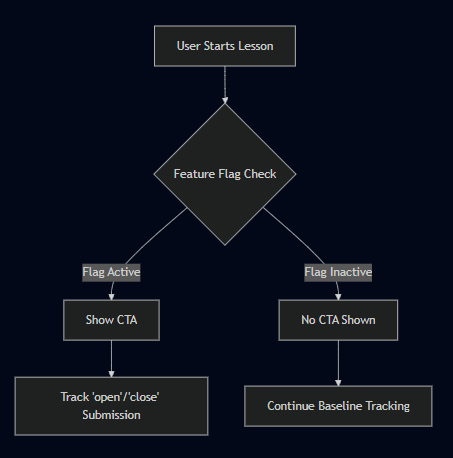
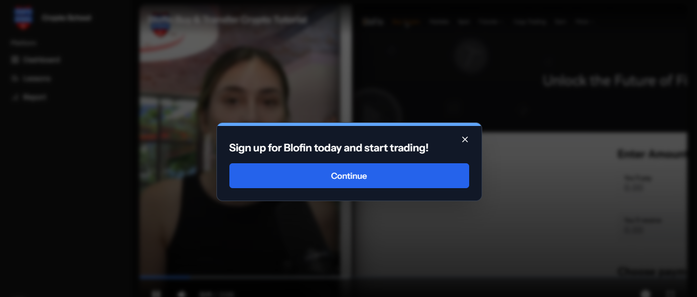
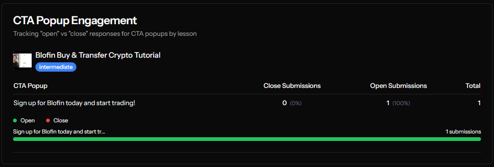
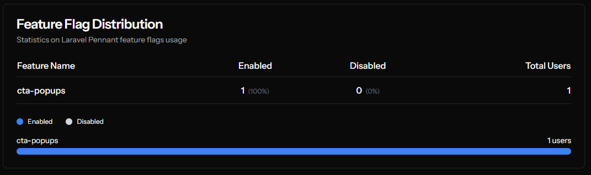

# Player Popups Engagement Experiment

This repository contains the implementation of an A/B testing experiment for video player popups, comparing the engagement performance of quiz popups vs. CTA popups.

## 📋 Table of Contents

- [Installation](#installation)
- [Project Overview](#project-overview)
- [Video Player Integration](#video-player-integration)
- [Popup Feature & A/B Testing](#popup-feature--ab-testing)
- [Monitoring & Future Enhancements](#monitoring--future-enhancements)

## Installation

```bash
composer install
php artisan migrate --seed
npm run build   # Or use: npm run dev
npm run storybook
php artisan serve # Or run with Herd
```

## Project Overview

The project is built using **Laravel 12** with a Vue.js starter kit. It comes with a pre-built layout, making the initial setup straightforward.

- **Lessons Page:** Displays lessons retrieved from a database seeded after migration.
- **Lesson Detail Page:** Uses a UUID to fetch and display the actual video.

## Video Player Integration

### Video Player Setup

- **YouTube Integration:** The lesson page features a video player that uses the `youtube-nocookie` URL, which is compatible with the existing Crypto School implementation, allowing for database reuse.
- **Security Measures:** Prevents direct user interaction with the YouTube iframe through custom implementation.
- **Customization:** Fully customizable player using YouTube's iframe API for dynamic video interactions.

## Popup Feature & A/B Testing

### Popup Types

- **Quiz Popup:** Original engagement feature
- **CTA Popup:** New experimental feature being tested

### Feature Flag Implementation

**Laravel Pennant** is used for feature flagging to randomly assign users to test groups:

- **Variant Group (25%):** Users who receive the new CTA popup
- **Control Group (75%):** Users who experience the original popup experience
- **Admin Users:** Always have access to the new popup feature



```php
// AppServiceProvider.php
Feature::define('player-popups', function (User $user) {
    if ($user->isAdmin()) {
        return true;
    }
    return Lottery::odds(25 / 100);
});
```

To manually enable the feature for specific users, you can update the `features` table, setting the value to `true` for the targeted user.

### Engagement Tracking

When a user interacts with the CTA popup, a request is sent to the backend to log their action:

- Whether they clicked the CTA button
- Whether they closed the popup
- The timestamp of the video when interaction occurred

This data helps calculate conversion metrics and optimize popup timing for maximum engagement. The system tracks when popups are most effective during video playback.

The popups are designed to be highly engaging while maintaining a clean, unobtrusive UI that complements the video content.


_Example of a popup displayed during video playback_

## Monitoring & Future Enhancements

### Current Dashboard

A comprehensive dashboard has been developed to monitor experiment results in real-time:





- User engagement metrics across both test groups
- Conversion rates based on popup appearance and timing
- Comparative analysis between control and variant groups

### Future Enhancements

Improvements to the system can include:

- Management system for scheduling popup appearance times and feature flags
- Adjustable feature rollout percentages through an admin interface
- Per-user feature activation controls
- Advanced analytics to determine optimal timing for different video lengths
